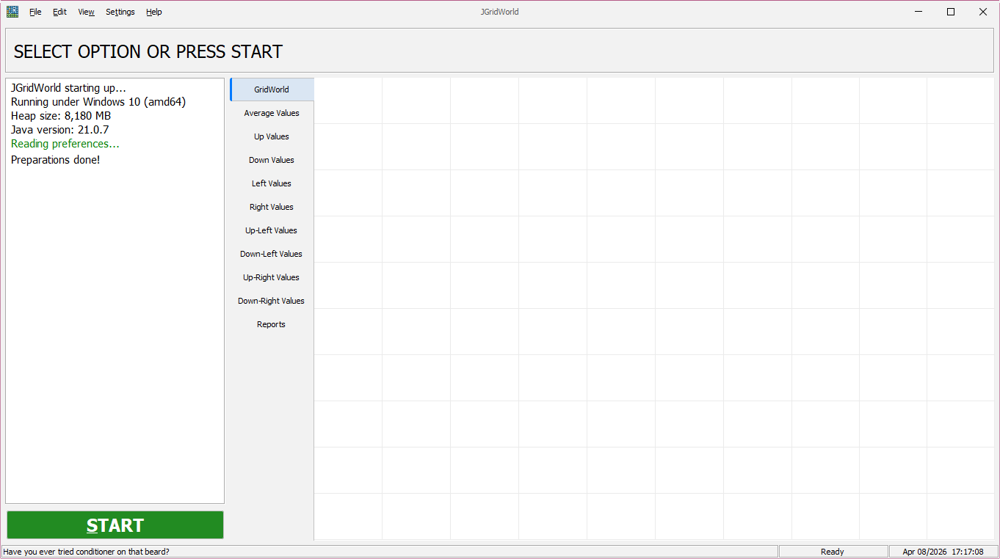
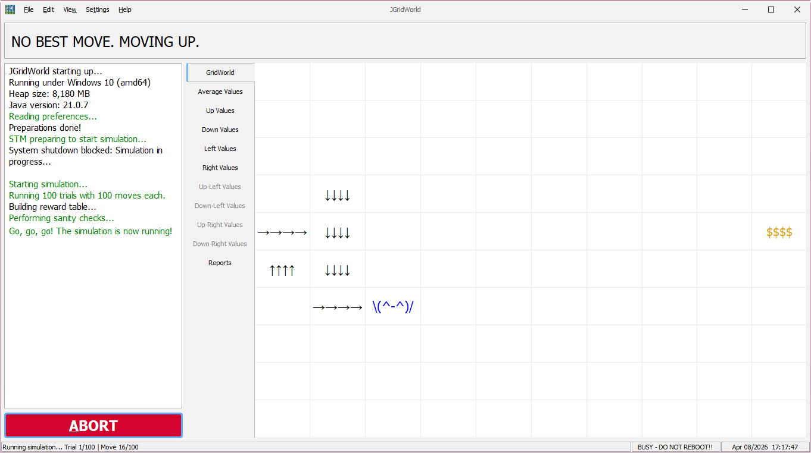
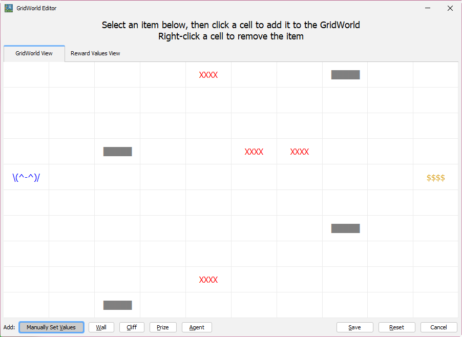
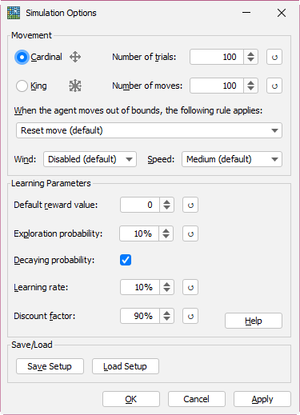
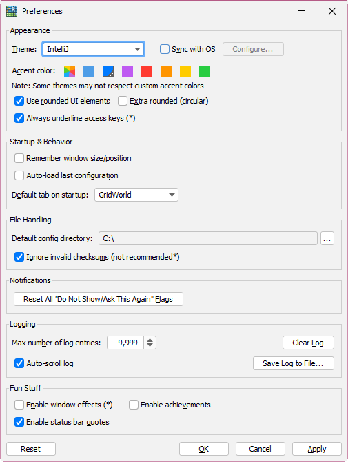

# JGridWorld

JGridWorld is a Java-based grid world editor and simulation tool. It provides a graphical interface for creating, editing, and interacting with grid-based environments.

## Features

- Interactive grid world editor
- GUI-based controls
- Many (MANY) themes
- Automatic theme synchronization with OS
- Achievement tracking system (in-progress)
- Packaged as a runnable JAR

## Project Structure

jgridworld/

├── src/main/java/com/gerneralmagic/jgridworld/   # Main source code

├── META-INF/                                     # Manifest and metadata

└── pom.xml                                       # Maven configuration

## Requirements

- Java 21 or higher
- Maven (for building)

## Build Instructions

### Using Maven

1. Clone the repository:
   ```bash
   git clone https://github.com/nemu64/jgridworld.git
   cd jgridworld
2. Build the project:
    ```mvn clean package```

The compiled JAR will be located in:
target/

## Screenshots

### Main Window


### Running Simulation


### Gridworld Editor


### Simulation Options


### Preferences

